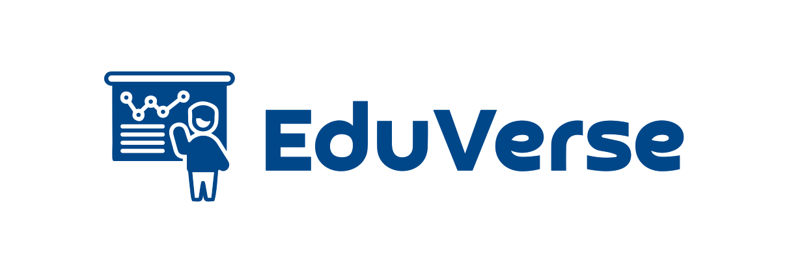

# EduVerse - Learning Management System (LMS)

 <!-- Replace with your logo if available -->

EduVerse is a powerful Learning Management System (LMS) that provides a comprehensive platform for both students and teachers to enhance their educational experiences. This platform offers a range of features designed to make learning and teaching more effective and enjoyable.

## Table of Contents

- [Key Features](#key-features)
- [Technologies Used](#technologies-used)
- [Installation](#installation)
- [Usage](#usage)
- [Contributing](#contributing)
- [License](#license)

## Key Features

### For Students

- **Browse & Filter Courses**: Easily discover and filter through available courses to find the ones that interest you.

- **Purchase Courses using Stripe**: Seamlessly make payments for courses using the secure Stripe payment gateway.

- **Mark Chapters as Completed or Uncompleted**: Keep track of your progress by marking chapters as completed or uncompleted.

- **Progress Calculation of Each Course**: Get insights into your progress within each course, helping you stay on track.

- **Student Dashboard**: Access your personal dashboard to view enrolled courses, track your progress, and manage your profile.

### For Teachers

- **Teacher Mode**: Switch to teacher mode to create and manage courses, chapters, and student interactions.

- **Create New Courses**: Develop new courses by providing course details, descriptions, and attaching relevant materials.

- **Create New Chapters**: Add chapters to your courses with rich text descriptions and various media attachments.

- **Easily Reorder Chapter Position with Drag n’ Drop**: Rearrange the chapter order in your course using an intuitive drag-and-drop interface.

- **Upload Thumbnails, Attachments, and Videos using UploadThing**: Easily add multimedia content to your chapters.

- **Video Processing using Mux**: Ensure smooth video playback with video processing capabilities provided by Mux.

- **HLS Video Player using Mux**: Deliver high-quality video content with an HLS video player powered by Mux.

### General Features

- **Rich Text Editor for Chapter Descriptions**: Create rich and engaging content using the built-in rich text editor.

- **Authentication using Clerk**: Secure user authentication and identity management through Clerk.

- **ORM using Prisma**: Utilize Prisma as the Object-Relational Mapping (ORM) tool for efficient database operations.

- **MySQL Database using Planetscale**: Store and manage data in a secure and scalable MySQL database powered by Planetscale.

## Technologies Used

EduVerse is built using the following technologies:

- **Frontend**:
  - [React](https://reactjs.org/)
  - [Next.js](https://nextjs.org/)
  - [Stripe](https://stripe.com/)

- **Backend**:
  - [Node.js](https://nodejs.org/)
  - [Prisma](https://www.prisma.io/)
  - [Planetscale](https://planetscale.com/)

- **Media Processing**:
  - [Mux](https://mux.com/)
  - [UploadThing](https://uploadthingy.com/)

- **Authentication**:
  - [Clerk](https://clerk.dev/)

## Installation

To set up EduVerse on your local environment, follow these steps:

1. Clone the repository:

```bash
git clone https://github.com/your-repo/ediverse.git
```

2. Navigate to the project folder:

```shell
cd ediverse
```

3. Install dependencies:


```shell
npm install
```

4. Set up environment variables and configuration files as specified in the project's documentation.

5. Start the development server:

```shell
npm run dev
```

## Usage

Once you have the app up and running, you can start exploring courses, making payments, and managing your learning materials. If you are a teacher, you can switch to teacher mode and begin creating courses, chapters, and enriching your students' learning experience.

## Contributing

We welcome contributions from the community. If you'd like to contribute to EduVerse, please follow our [contribution guidelines](CONTRIBUTING.md).

## License

EduVerse is licensed under the [MIT License](LICENSE). Feel free to use, modify, and distribute it according to the terms of this license.

For more details and usage instructions, please refer to the project's documentation.

Happy Learning with EduVerse!
